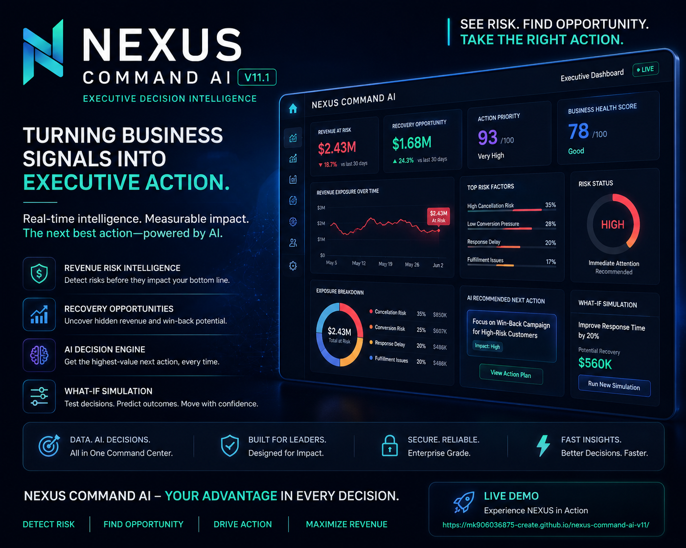

 # ⚡ NEXUS COMMAND AI V11.1

<p align="center">

# 🧠 NEXUS COMMAND AI

### Enterprise Autonomous Decision Intelligence Engine

**Turn Business Signals Into Executive Decisions.**

</p>

<p align="center">

<a href="https://mk906036875-create.github.io/nexus-command-ai-v11/">

</a>


</p>

---

# 🚀 LIVE DEMO

<p align="center">

<a href="https://mk906036875-create.github.io/nexus-command-ai-v11/">



</a>

</p>

<p align="center">

### 🧠 Enterprise Autonomous Decision Intelligence

**Click the dashboard above to launch the live product.**

</p>

<p align="center">

<a href="https://mk906036875-create.github.io/nexus-command-ai-v11/">


</a>

</p>

---

# 🎯 PRODUCT OVERVIEW

**NEXUS COMMAND AI V11.1** is an enterprise-focused autonomous decision intelligence platform designed to transform complex business signals into clear executive decisions.

Traditional dashboards show data.

NEXUS is designed to move beyond dashboards by connecting:

```text
BUSINESS SIGNALS
       ↓
INTELLIGENCE
       ↓
RISK DETECTION
       ↓
REVENUE EXPOSURE
       ↓
AI DECISION
       ↓
EXECUTIVE ACTION
       ↓
BUSINESS OUTCOME
